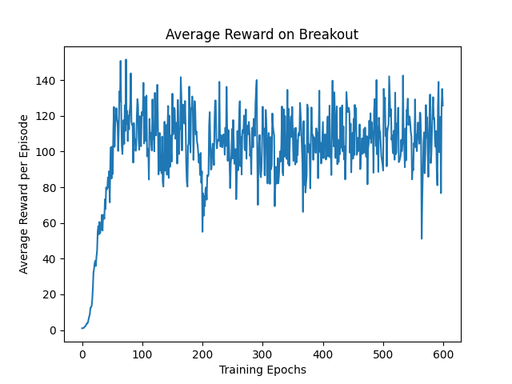

# Deep Reinforcement Learning with Double Q-learning

solving paper [Deep Reinforcement Learning with Double Q-learning](https://arxiv.org/abs/1509.06461).

## Usage

```commandline
$ pip3 install -r requirements.txt
$ python3 Double-DQN.py
```

## Results


#### Average reward on Breakout

